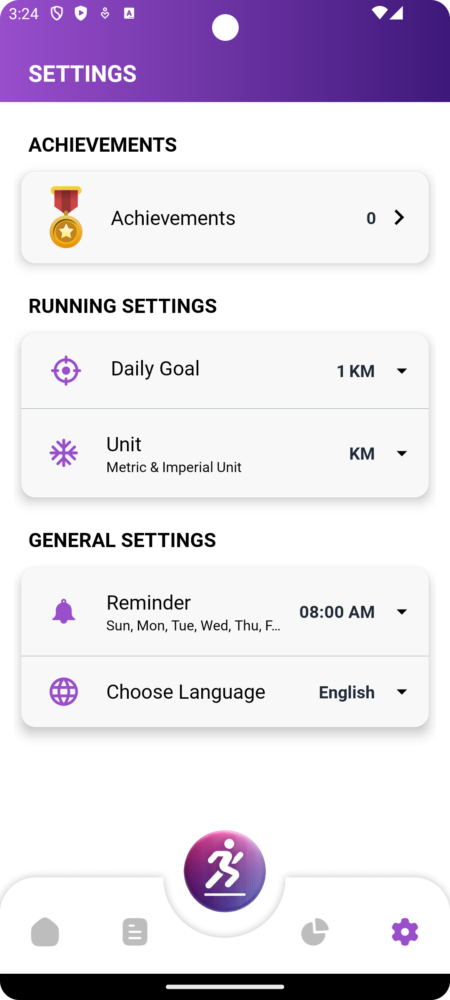

# Level Up Application

## Logo
  

## Description

Achieve your fitness goals with **Level Up**, an intuitive app designed to track and analyze your running activities with precision. Whether you're a seasoned marathon runner or just starting out, Run Tracker offers real-time GPS tracking, insightful statistics, and interactive graphs to help you stay motivated and improve your performance.

## Key Features

- **Real-Time GPS Tracking**: Record your runs with accurate GPS tracking and save your routes. Share your mapped-out paths with friends and family to celebrate your milestones.

- **Comprehensive Running History**: Keep a detailed log of all your runs, including distance, time, and calories burned, so you can monitor your improvement over time.

- **Detailed Graphs & Analysis**: Dive into your stats with easy-to-read graphs showing your performance metrics such as speed, distance, and time. Use these insights to identify trends and areas for improvement.

- **Personalized Settings**: Customize the app according to your needs. Set daily goals, choose between metric or imperial units, and select your preferred language for a tailored experience.

- **Cloud Sync**: Seamlessly sync your running data with your Google account, ensuring all your progress is backed up and accessible across multiple devices.

## Technology Stack

- **Android Kotlin**: Developed using Android Kotlin for optimal performance on Android devices, offering a smooth and native user experience.

- **Google AdMob**: Integrates in-app advertisements to generate revenue without interrupting the user experience.

- **Firebase**: Powers data storage, user authentication, and real-time syncing, ensuring your running stats and progress are securely managed and accessible in real-time.

## Screenshots

Here are some screenshots of LevelUp in action:

  
  
  
  
  
  

## Download Demo

You can download the demo version of LevelUp here:

- [Download for Android](https://drive.google.com/file/d/1c1Gvue3kBF5_luPuGwEZuEEtwMlX9m9q/view?usp=sharing)
